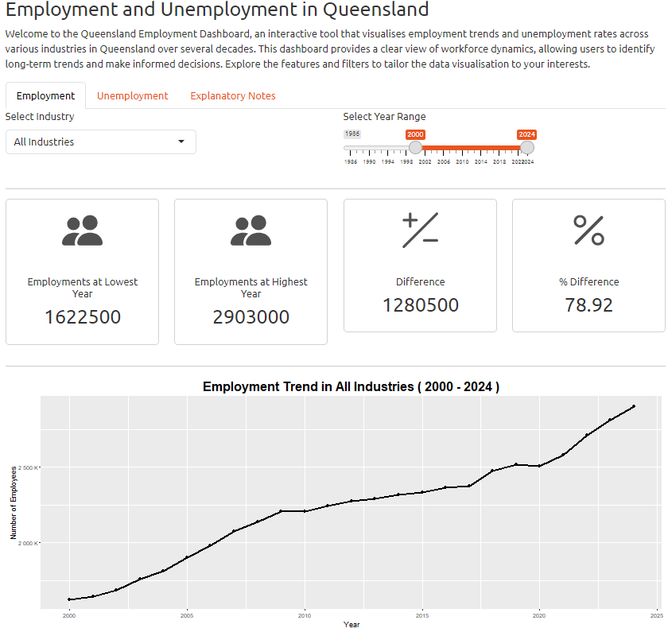
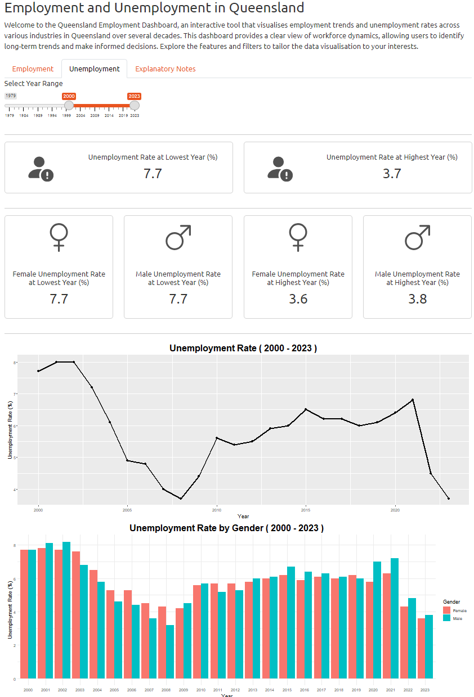
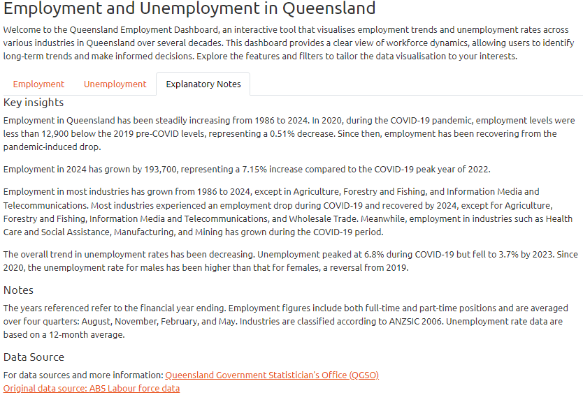

# qld-employment-dashboard-r-shiny

This project visualises employment trends and unemployment rates in Queensland, Australia, spanning several decades. 

Utilising the RShiny and ggplot2 packages, it features an interactive dashboard that allows users to explore and analyze the data dynamically. 

The dashboard provides various interactive elements, such as sliders, and drop-down menus, enabling users to filter and visualise specific time periods, industries, and employment metrics.

## Dashboard interface:

